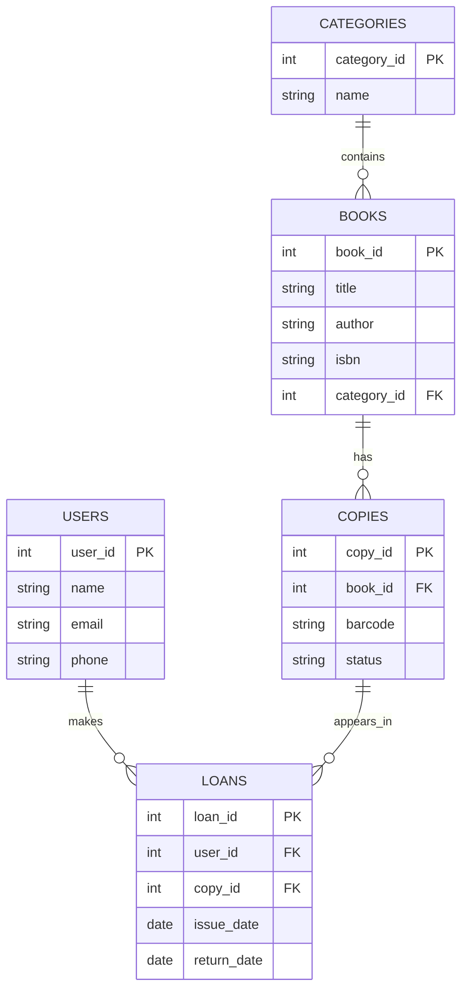

```mermaid
erDiagram

    CATEGORIES ||--o{ BOOKS : contains
    BOOKS ||--o{ COPIES : has
    USERS ||--o{ LOANS : makes
    COPIES ||--o{ LOANS : appears_in

    CATEGORIES {
        int category_id PK
        string name
    }

    BOOKS {
        int book_id PK
        string title
        string author
        string isbn
        int category_id FK
    }

    COPIES {
        int copy_id PK
        int book_id FK
        string barcode
        string status
    }

    USERS {
        int user_id PK
        string name
        string email
        string phone
    }

    LOANS {
        int loan_id PK
        int user_id FK
        int copy_id FK
        date issue_date
        date return_date
    }
```